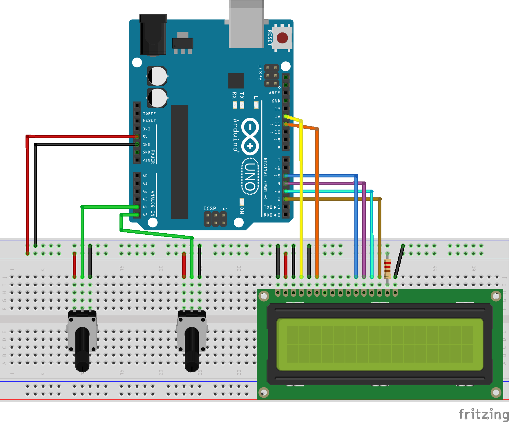
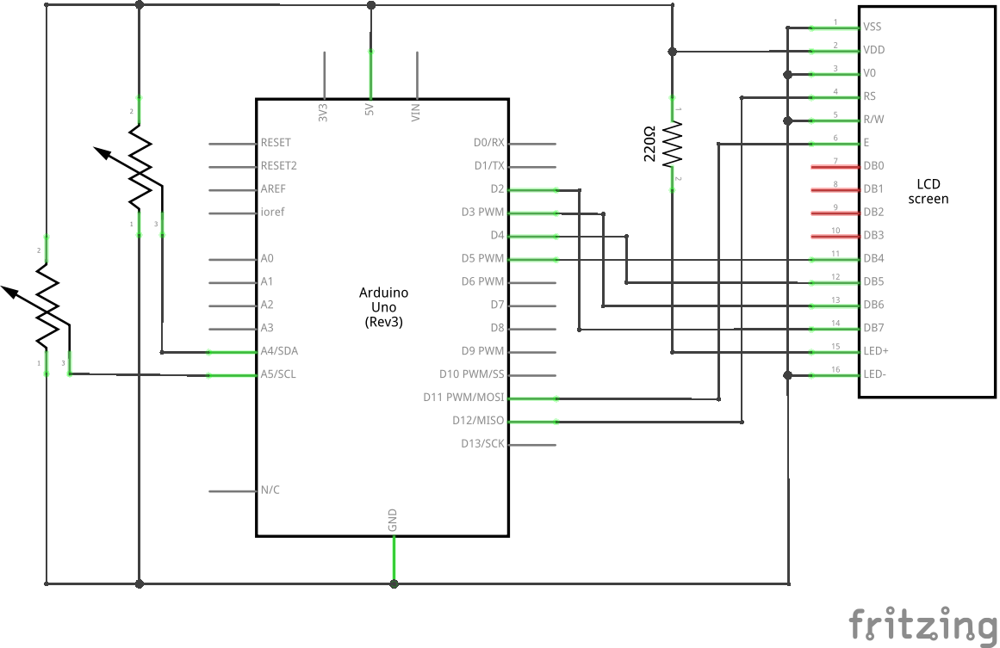

# Vitorlás iránytű
###### Eltérés számítása a kívánt irány és a haladási irány között Arduino platformon, LCD kijelzővel.

A projekt Pali kollégám megrendelésére készült, aki egy saját készítésű navigációs eszközt szeretne a vitorláshajójára. A "Vitorlás iránytű" feladata, hogy az előre betáplált cél-irány és a mért haladási irány közötti eltérést kiszámolja. A betáplált és a mért adat az északi iránytól való eltérést reprezentálja fokban megadva. Pl. ha a cél délkeleti irányban van, akkor 135 fokot kell beállítani. A mért irány hasonlóan működik: ha dél felé halad a hajó, akkor a mért irány 180 fok. A két irány közötti eltérés ismerete az egyik legfontosabb adat a hajó navigátora számára. A saját készítésű navigációs eszköz egyik modulja ezt az értéket (és az érték előjelét) számítja ki. A "Vitorlás iránytű" kódja ennek egy megoldása.

Videó a működésről: [demo.mp4](demo.mp4)

## Breadboard

Az áramkör fotón: [breadboard.jpg](breadboard.jpg)

## Áramkör

## Forráskód
[Vitorlas-Iranytu.ino ](Vitorlas-Iranytu.ino)
